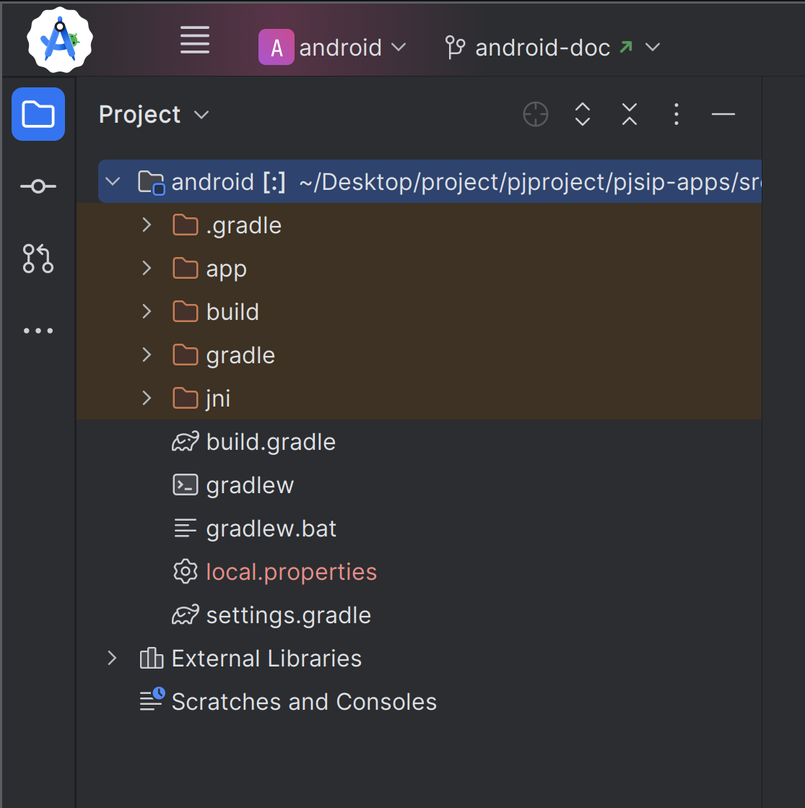
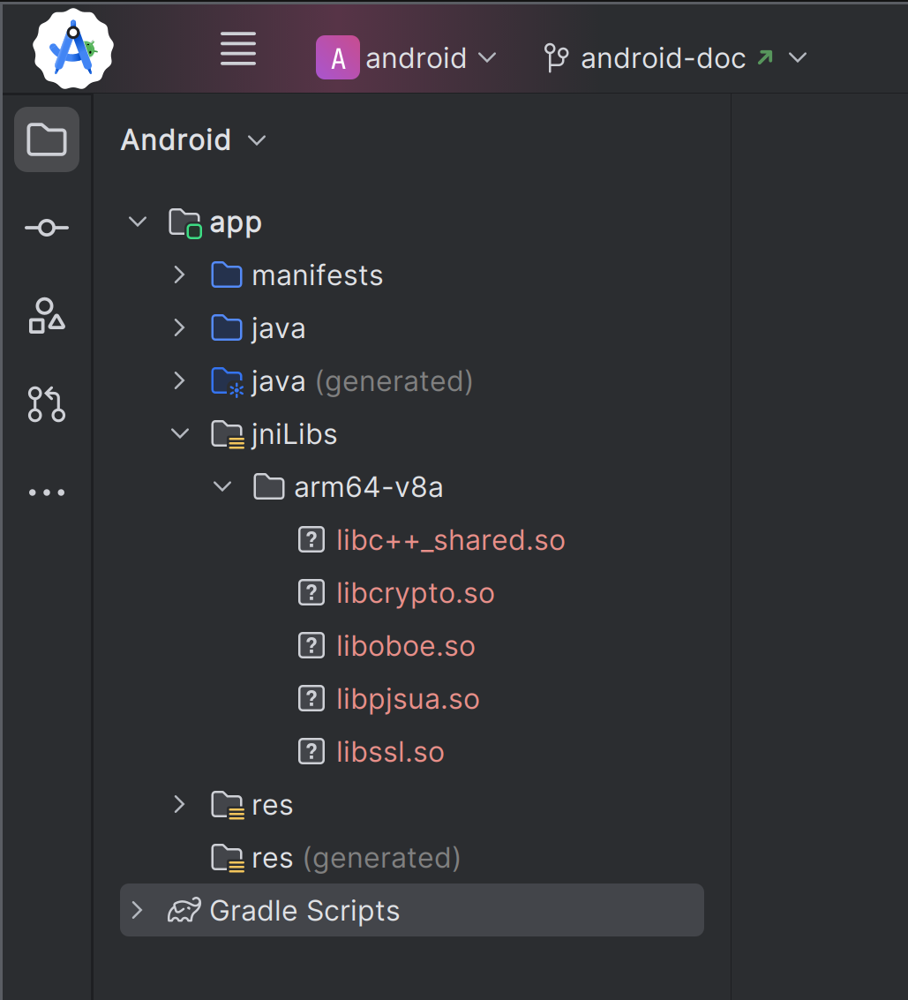
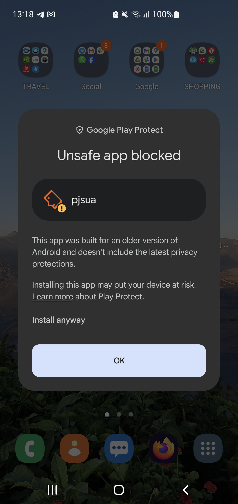
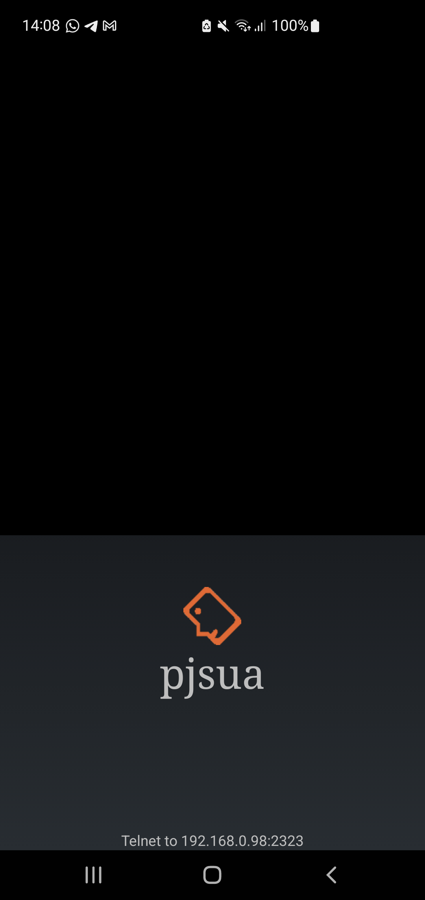

Command line/telnet SIP client example
========================================
The CLI (command line interface) SIP client is a usual :doc:`/samples/pjsua` with telnet command
line user interface. Application flow and user interface are
handled mainly at the native level, so it doesn't use pjsua2 API with Java interface.

We use this app as convenient way to test the library without having to worry about user interface..

.. contents:: Step by step guide:
   :depth: 2
   :local:

Build the native code
----------------------------------------
We assume that PJPROJECT has been set up and built for Android, by follwing the
:doc:`build_instructions`. Then follow these steps to build the native code:

1. Enable building applications which otherwise will not be built using standard command. Assuming you're on Bash shell:

   .. code-block:: shell

        $ export EXCLUDE_APP=0

2. Build native pjsua. We're not going to use the native application, but rather we need the
   object files (``*.o``) to be packaged in ``libpjsua.so`` in the next step.

   .. code-block:: shell

        $ cd pjsip-apps/build
        $ make pjsua

3. Build ``libpjsua.so``, the JNI interface to be used by the Android Java application:

   .. code-block:: shell

        $ cd ../src/pjsua/android/jni/
        $ make

   The command above will/should also copy ``libpjsua.so`` and ``libc++_shared.so``
   to ``pjsip-apps/src/pjsua/android/app/src/main/jniLibs/$ARCH`` directory.

   .. note::

    This library is **libpjsua.so**, while the library used by the Java and Kotlin sample apps
    is **libpjsua2.so**.

Copy the third party native libraries
----------------------------------------
Follow the instructions in :ref:`android_copy_3rd_party_libs`, except that you will set the initial
directory (the application directory) to ``pjsip-apps/src/pjsua/android/app/``.

Open in Android Studio
----------------------------------------
Open pjsua CLI app project in Android Studio, it is located in :source:`pjsip-apps/src/pjsua/android``
Once opened, you will probably see display like the screenshot below on your project tree:

And some errors on the **Build** tab:

::

    Your build is currently configured to use incompatible Java 21.0.4 and Gradle 5.4.1.
    Cannot sync the project.

    We recommend upgrading to Gradle version 8.9.

    The minimum compatible Gradle version is 8.5.

    The maximum compatible Gradle JVM version is 12.

    Possible solutions:
    - Upgrade to Gradle 8.9 and re-sync
    - Upgrade to Gradle 8.5 and re-sync

Just follow the recommendation to upgrade to Grandle newer version by clicking
**Upgrade to Gradle 8.9 and re-sync** above.

.. tip::

    If you encounter **Unable to load class org.gradle.initialization.BuildCompletionListener** error,
    close Android Studio, delete ``gradle`` directory (under ``pjsip-apps/src/pjsua/android`` directory),
    and re-open Android Studio.

If there is a pop-up recommendation to upgrade the project *Android's Gradle plugin*, follow
**AGP Upgrade Assistant** suggestion (or later choose **Tools > AGP Upgrade Assistant..** from the
menu).

Once the upgrades are successful, the project will look something like this:

Expand and check the contents of **jniLibs/$ARCH** folder in the project view as shown above, it
should contain at least five shared libraries as shown in the above screenshot.

Build the project
-----------------------------
Select from the menu **Build > Make Project** or press **Ctrl+F9** if you're on
Linux/Windows or **Command+F9** if you're on MacOS.

Run or debug the app
-------------------------
Select **Run > Run 'app'** or click the **Run** button from the toolbar (or **Debug** instead).

First time you deploy the app, you will probably see warning about **Unsafe app blocked**, like this:

Press **Install anyway** and authenticate the device to install the app.

If all is well, you should see the application displaying the address to telnet to, like the following:

If you encounter errors, see if the issues have been addressed in :doc:`issues`.

Using the CLI app
-------------------------
You can telnet to the address shown on the device. At any point, you can type **?** to get help:

.. code-block:: shell

    $ telnet 192.168.0.98 2323
    Trying 192.168.0.98...
    Connected to 192.168.0.98.
    Escape character is '^]'.
    localhost> ?
                ^
    log                   Change log level
    exit                  Exit session
    call                  Call related commands
    im                    IM and Presence Commands
    acc                   Account commands
    audio                 Conference and Media commands
    stat                  Status and config commands
    video                 Video commands
    sleep                 Suspend keyboard input
    network               Detect network type
    shutdown              Shutdown application
    restart               Restart application
    ip_change             Handle IP change
    toggle_sdp_offer | o  Toggle SDP offer use on subsequent calls and UPDATEs

    localhost> acc ?
                    ^
    add | +a    Add new account
    del | -a    Delete account
    mod | !a    Modify account
    reg | rr    Send (Refresh) Register request to register
    unreg | ru  Send Register request to unregister
    next | <    Select the next account for sending outgoing requests
    prev | >    Select the previous account for sending outgoing requests
    show | l    Show account list
    localhost>  acc 

For more information about the CLI commands, see :doc:`/specific-guides/other/cli_cmd`.

What's next
---------------------------
This concludes our tutorial about building, opening, installing, running, and debugging SIP
sample applications for Android.

Next is the guide to create your own SIP Android application based on PJSIP and how to install
optional Android features.
