Android Java SIP VoIP and Video Client Example
=======================================================

This guide will give you step by step tutorial to open, build, run, and debug PJSIP Android Java
SIP client sample application using `Android Studio <https://developer.android.com/studio>`__.
The sample application supports TLS, voice calls with AMR NB/WB codecs, and H.264 video calling,
using native codecs provided by the phone.

.. contents:: Step by step guide:
   :depth: 2
   :local:

Open the apps in Android Studio
----------------------------------------
Launch **Android Studio**, open the project at :source:`pjsip-apps/src/swig/java/android`.

.. tip::

  If you encounter errors (in the *Build* tab), something like:
   
   
  ::

    android: failed, Your build is currently configured to use incompatible 
    Java 21.0.4 and Gradle 7.5. Cannot sync the project..
    We recommend upgrading to Gradle version 8.9.
    The minimum compatible Gradle version is 8.5.

    Possible solutions:
    * Upgrade to Gradle 8.9 and re-sync.
    * Upgrade to Gradle 8.5 and re-sync.

  Just follow the recommendation to upgrade to Grandle newer version by clicking
  **Upgrade to Gradle 8.9 and re-sync** above.

  Once the upgrade completes (you see *BUILD SUCCESSFUL* message), follow the pop-up recommendation
  to upgrade the project *Android's Gradle plugin* by following **AGP Upgrade Assistant** suggestion
  (or choose **Tools > AGP Upgrade Assistant..** from the menu).

Once loaded properly, the project tree will look something like this:

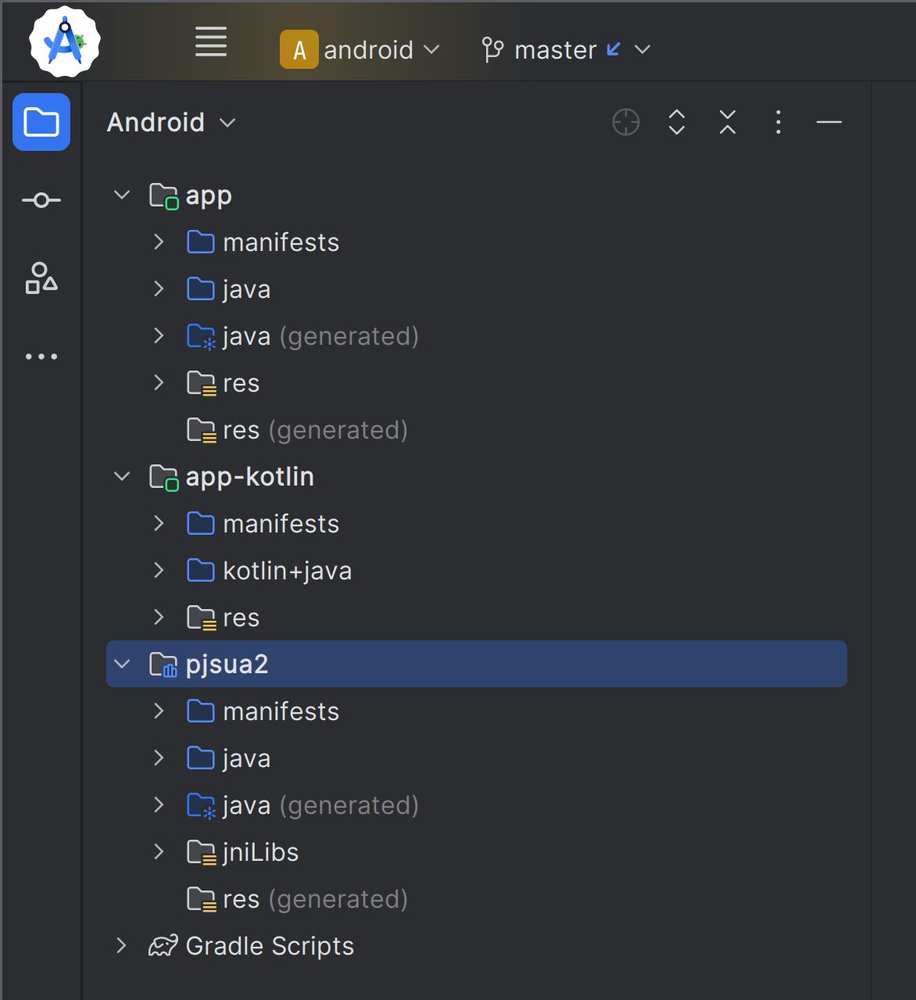

It contains three modules:

- **app**, Pjsua2 sample app: :source:`pjsip-apps/src/swig/java/android/app`
- **app-kotlin**, Kotlin sample app: :source:`pjsip-apps/src/swig/java/android/app-kotlin`
- **pjsua2**, pjsua2 Java interface: :source:`pjsip-apps/src/swig/java/android/pjsua2`

Build the project
-----------------------

Select from the menu **Build > Make Project** or press **Ctrl+F9** if you're on
Linux/Windows or **Command+F9** if you're on MacOS to build all modules in the project.

.. tip::

   If you have tons of errors at this stage, it may be because the project is not compatible with
   your Android Gradle plugin. Try to upgrade it from by selecting from the menu **Tools > 
   AGP Upgrade Assistant...**.

Run or debug Pjsua2 app
-------------------------

* From the toolbar, select **app** as the default app to launch.
* Select **Run > Run 'app'** or click the **Run** button from the toolbar (or **Debug**
  instead).
* The app (which is named **Pjsua2** in the Android device) should be launching on your
  device (either emulator or real device)
* First time it will ask for camera and recorder permissions, which you should allow.

Once started, initially you will see blank Pjsua2 application like this:

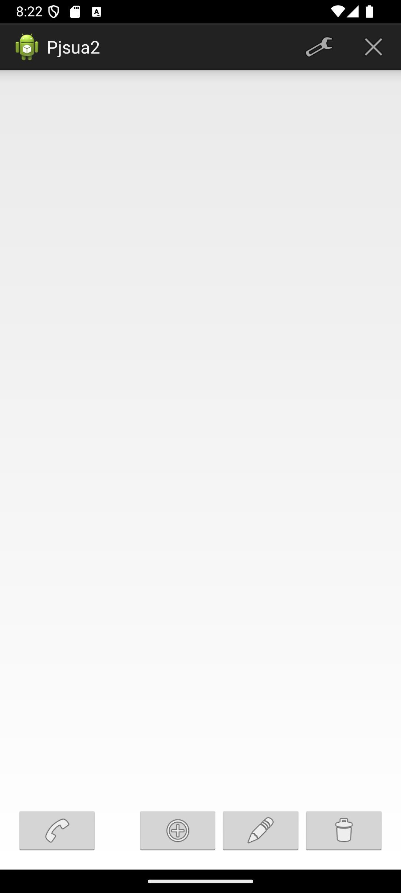

.. tip::

  For any problems, first of all open Logcat tool window by selecting
  **View > Tool Windows > Logcat**.
  
  Then see if the issues have been addressed in :doc:`issues`.

Set account and register to server
-----------------------------------------

Click the wrench icon and set the SIP account to register. Remember that we have added OpenSSL
to our build, so let's use TLS transport to connect to the
SIP server. Also it happens that my home router has ALG that messes up SIP traffic, so that is
another good reason to use TLS.

These are my settings:

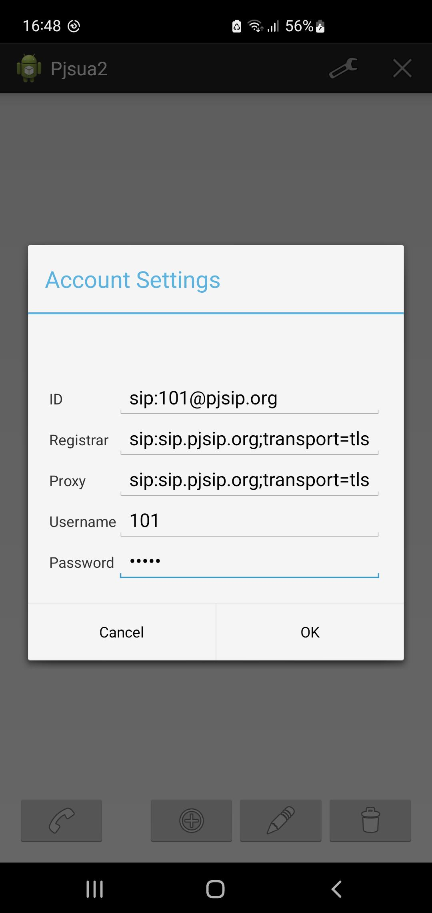

Click OK to close the dialog and start registering to the SIP server. You can check the
registration status in the Logcat window or by opening the account dialog and see the
last registration status as displayed below.

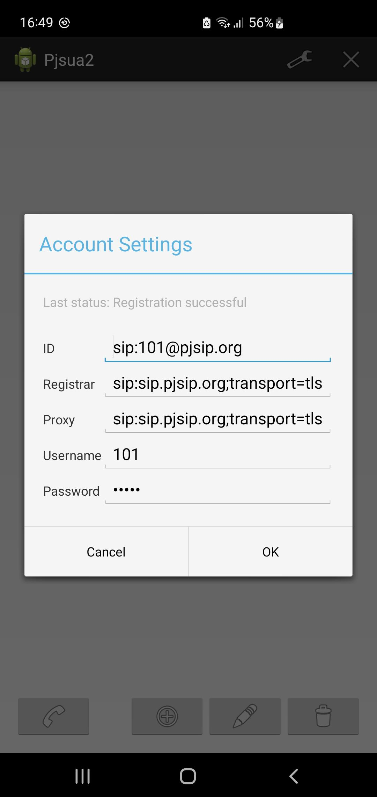

Add buddy
-----------------------------------------

Once registration is successful you can start adding buddies. Here I'm adding
`MicroSIP <https://www.microsip.org>`__ application that's running on Windows:

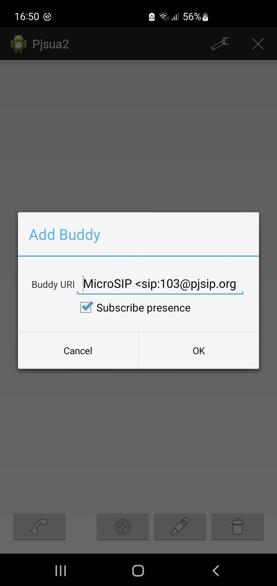

I will also add **pjsua** application that is running on Linux.

After you click OK, the application will query the presence availability of the buddy and
display the presence status below the URI, as shown below:

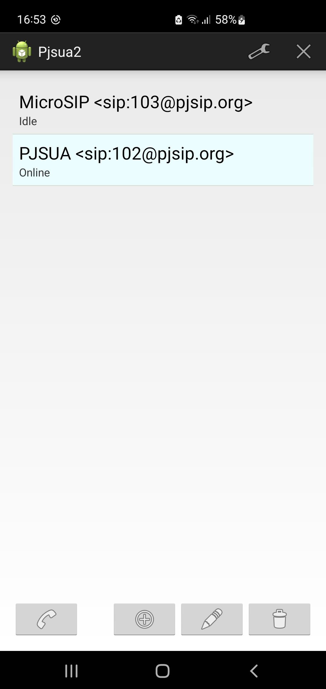

Dialing/making a call
-----------------------------------------

Select the buddy, and click the phone icon to make a call:

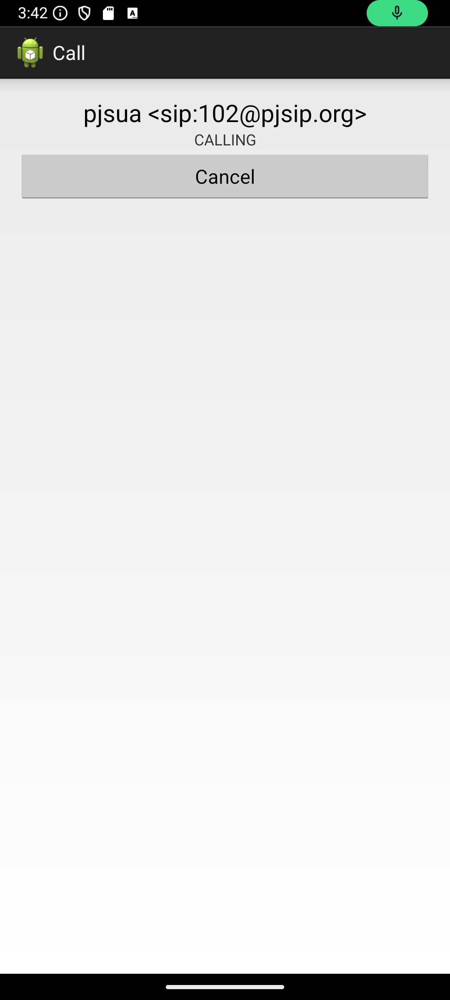

Once the other side answers, the call is connected:

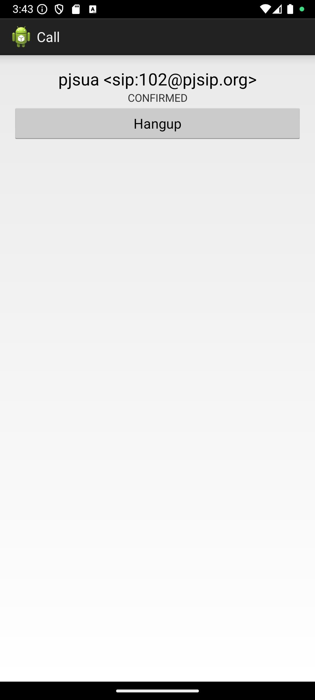

Click the Hangup button to hang up.

Receiving incoming call
-----------------------------------------
When you have an incoming call, you will get notification like this:

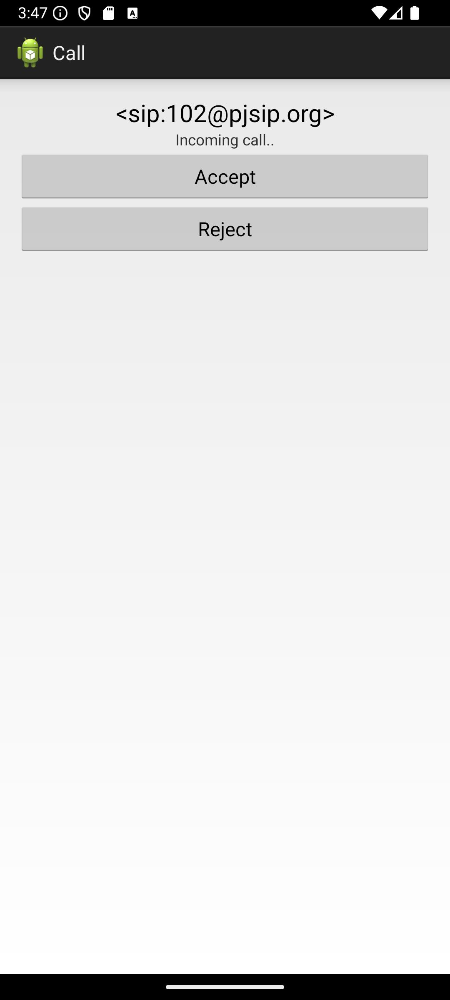

You may accept or reject the call by pressing the appropriate button.

Video calls
-----------------------------------------
You can get video calls when dialing/receiving calls from another SIP dialer/application that
supports video, such as  `MicroSIP <https://www.microsip.org>`__, an excellent open source SIP
voice and video softphone for Windows and possibly other platforms, or another pjsua instance.

Here is screenshot of a rather unexciting call with myself:

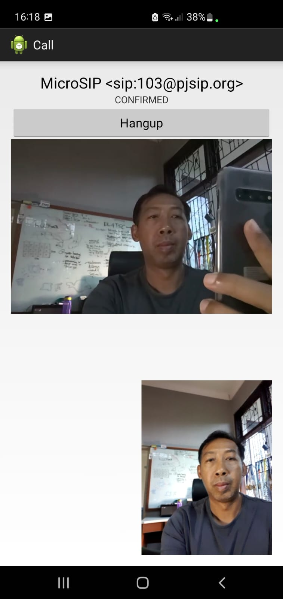

and just for reference, here's what it looks like on the MicroSIP Windows side:

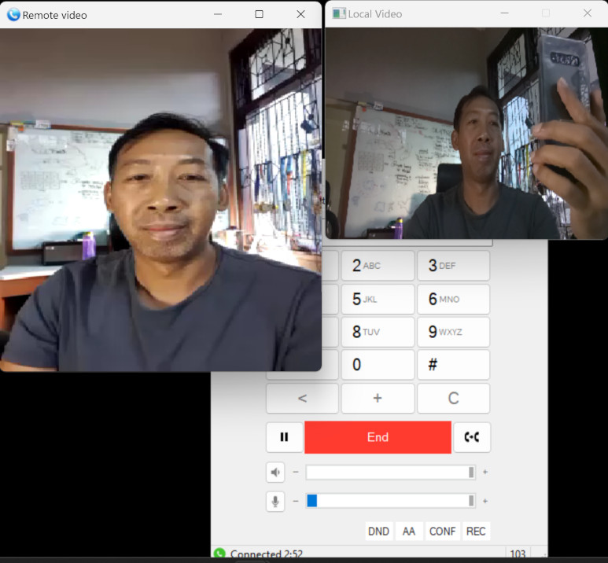

Notes on NAT
----------------------------------------
While ICE is enabled in this sample, STUN is not. The media, both audio and video, work on this
call simply because both devices are on the same LAN. If you have issues with no media, you can
modify the :source:`source code <pjsip-apps/src/swig/java/android/app/src/main/java/org/pjsip/pjsua2/app/MyApp.java>`
and add STUN server.

Notes on video quality
----------------------------------------
Video quality can be improved by increasing the bitrate. See :doc:`specific-guides/video/users_guide`
for more information.

For reference, the call above was using 320x240 video resolution and about 260 Kbps average bitrate
on both transmit and receive side.

What's next
---------------------------
We have shown that Pjsua2 app sample, while it is very simple both UI and coding wise (it's less
than 2K lines of code, see the source code in :source:`pjsip-apps/src/swig/java/android/app`),
we have built an Android SIP voice and video client application supporting SIP, secure transport
(TLS), voice, AMR wideband audio codec, H.264 video, ICE for NAT traversal, and RTP/RTCP.

By tweaking the :source:`source code <pjsip-apps/src/swig/java/android/app/src/main/java/org/pjsip/pjsua2/app/MyApp.java>`
a little bit, you can enable features such as STUN server, event publication, increasing video
bitrate for better quality, and so on.

Let's move on to another Android SIP application example, this time it's Kotlin based.
