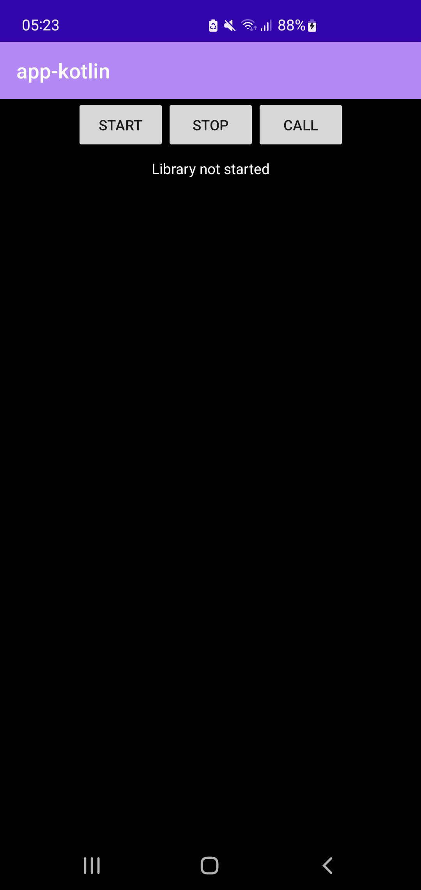
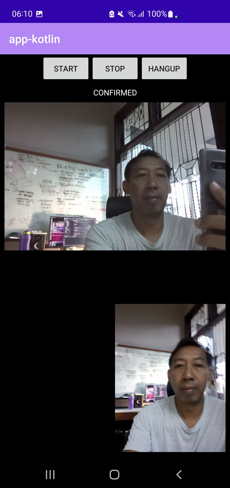
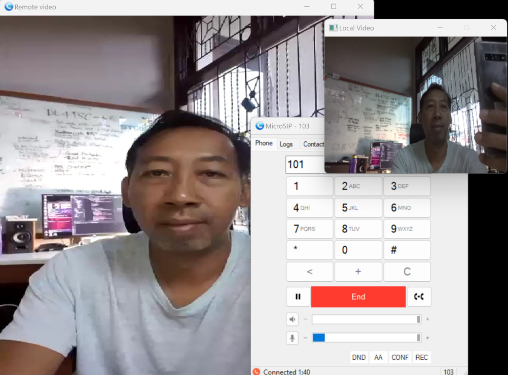

Kotlin SIP Voice and Video Client Example
===========================================

This guide will introduce you to our Android Kotlin sample application that can be opened with
`Android Studio <https://developer.android.com/studio>`__. 
The sample application supports TLS, voice calls with AMR NB/WB codecs, and H.264 video calling,
using native codecs provided by the phone.

.. contents:: Step by step guide:
   :depth: 2
   :local:

Open the app in Android Studio
----------------------------------------
The Kotlin sample application is in the same project as previous 
:doc:`Java SIP client sample <java-sip-client>`, so if you have successfully opened the project,
you're all set. Otherwise follow the guide in :doc:`Java SIP client sample <java-sip-client>`
to open the project in Android Studio.

The module name for Kotlin sample app is **app-kotlin**.

Configuring SIP account and servers
---------------------------------------
To keep the sample application simple, all settings are hard-coded in the application.

.. tip::

    In fact the application is just one file with approximately 500 lines of code. Have a look at
    the source code of
    :source:`MainActivity.kt <pjsip-apps/src/swig/java/android/app-kotlin/src/main/java/org/pjsip/pjsua2/app_kotlin/MainActivity.kt>`

You will need to modify the SIP account and registrar and proxy servers, by
modifying these block of codes:

.. code-block:: kotlin

    // Account ID
    const val ACC_DOMAIN = "pjsip.org"
    const val ACC_USER   = "101"
    const val ACC_PASSWD = "--secret--"
    const val ACC_ID_URI = "Kotlin <sip:" + ACC_USER + "@" + ACC_DOMAIN + ">"
    const val ACC_REGISTRAR = "sip:sip.pjsip.org;transport=tls"
    const val ACC_PROXY  = "sip:sip.pjsip.org;lr;transport=tls"

Also the destination URI to dial:

.. code-block:: kotlin

    // Peer to call
    const val CALL_DST_URI  = "MicroSIP <sip:103@pjsip.org>"

Below are other settings that are used. To further customize the application, follow
:doc:`PJSUA2 guide </pjsua2/using/index>` and :doc:`PJSUA2 API reference </api/pjsua2/index>`:

- SIP transports: UDP, TLS
- Video codecs: H.264, VP8, VP9 (native codecs)
- Video resolution and bandwidth: 480x640, 1 Mbps (avg), 5 Mbps (max)
- Audio codecs: AMR WB/NB (native codecs), Speex NB/WB/UWB, iLBC, GSM, PCMU, PCMA, G.722
- ICE: -
- STUN: -

Build the project
-----------------------
Select from the menu **Build > Make Project** or press **Ctrl+F9** if you're on
Linux/Windows or **Command+F9** if you're on MacOS to build all modules in the project.

Run or debug the Kotlin app
-----------------------------

* From the toolbar, select **app-kotlin** as the default app to launch.
* Select **Run > Run 'app-kotlin'** from the menu or click the **Run** button from the toolbar
  (or **Debug** instead).
* The **app-kotlin** should be launching on your device
* First time it will ask for camera and recorder permissions, which you should allow.

Once started, you will see the minimalistic UI like the following:

Start the library
------------------------------
Press START to start the library.

Making and receiving calls
------------------------------
You can dial the preconfigured destination by clicking the **CALL** button, while incoming calls
will be answered automatically.

Here is a sample video call session (again a rather unexciting call with myself):

And here's the screenshot of the other side, a `MicroSIP <https://www.microsip.org>`__ softphone
running on Windows:

What's next
---------------------------
We have demonstrated that with a short, 500 lines of Kotlin code, PJSIP can be used to create
a simple but fully functional Android SIP voice and video calling application, with all the possibility to
extend it further into fully featured application with all the features as described in :doc:`sip-sdk-features`.

If you're curious with the code, have a look at the source code
:source:`MainActivity.kt <pjsip-apps/src/swig/java/android/app-kotlin/src/main/java/org/pjsip/pjsua2/app_kotlin/MainActivity.kt>`,
for some reference.

Next we will look at another sample application, the Android SIP CLI client.
