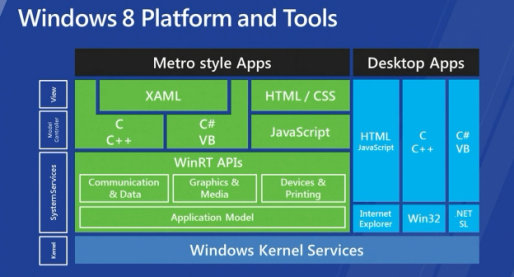
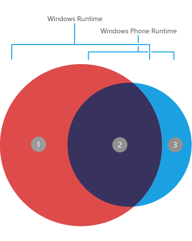

Windows Runtime (WinRT) Overview
================================

This document is compiled from various sources in hopes to give better
understanding in regards to WinRT and specifically its relation to
Windows RT and Windows Phone.

Windows Runtime
---------------

Windows Runtime, or shortly WinRT, is Microsoft's new programming model
that makes the backbone of the new Metro-style apps. It is designed in
hopes to solve many of the problems of Win32, from an apps perspective.
Apps created for WinRT are safe, secure, and sandboxed, can't wreck
other apps and all install in just 2-3 seconds. They feature isolated
storage, single folder installs (as per the Mac), and require user
consent to access the general file system.

   WinRT.png

WinRT isn't another abstraction layer; it's a new runtime sitting
directly on top of the Windows Kernel Services just like the good old
Win32 API as shown in the above figure. WinRT APIs includes a subset of
traditional Win32, Component Object Model (COM), and .NET Framework
APIs, as well as HTML5 and CSS3 APIs that are accessible to Metro style
app developers.

Windows RT
----------

Windows RT is another member of Windows family, previously known as
Windows on ARM (WOA). Software for Windows RT can be either downloaded
from Windows Store or sideloaded, although sideloading on Windows RT
must first be enabled by purchasing additional licenses through
Microsoft volume licensing outlet. Desktop software that run on previous
versions of Windows cannot be run on Windows RT as Windows Store apps
are based on Windows Runtime (WinRT) API which differs from the
traditional apps.

Although it's not confirmed, some said that “RT” stands for Runtime
which might be the source of confusion in regards to Windows Runtime
API. To make things less confusing between Windows RT and Windows
Runtime (API), we'll just call Windows Runtime API as WinRT.

Windows Phone Runtime
---------------------

Windows Phone Runtime(WPRT) is a subset of native API that is built into
the operating system.

   WPRT.png

The diagram has three distinct areas and these are described as follows:

#. The set of WinRT API not supported on WPRT.
#. The set of WinRT API adopted for WPRT API. This is represented by area 2 in the above diagram
   and consists of approximately 2,800 members. There might be some
   differences (types) which is noted in the API reference documentation.
#. The set of API adopted for WPRT are represented by area 3 in the
   diagram. These APIs use the WinRT style APIs, meaning you can use them
   regardless of the programming language you use for your app.

These are some features that are not available on WinRT API:

* Clipboard APIs
* Lock screen background provider
* Ringtone provider
* Alarms and reminders
* Lens Apps
* Photos extensibility
* VoIP apps
* Search Extras
* XNA SoundEffect APIs
* Generating bitmaps for Live Tiles in a Background Task using managed code

Windows Phone 8
---------------

It is the second generation of the Windows Phone mobile operating system
from Microsoft. WP8 can run app build based on WPRT API.

Windows Phone 8.1
-----------------

It is the update to WP8 and support app build based on WinRT API, thus
developers are given the choice of using WinRT API or WPRT API. Existing
app from WP8 (using WPRT) can reuse their code by upgrading their app to
Windows phone silverlight 8.1 app.

Reference:
----------

1. `WinRT overview 1 <http://en.wikipedia.org/wiki/Windows_Runtime>`__
2. `WinRT overview 2 <http://www.codeproject.com/Articles/328551/Part-Introduction-to-WinRT-the-new-Windows-Runti>`__
3. `Windows 8 editions <http://en.wikipedia.org/wiki/Windows_8_editions>`__
4. `What's next for Windows Phone 8 developers <https://msdn.microsoft.com/en-us/library/dn655121(v=vs.105).aspx>`__
5. `WinRT API reference <https://msdn.microsoft.com/en-us/library/br211377.aspx>`__
6. `WPRT API reference <https://msdn.microsoft.com/en-us/library/windows/apps/jj207212(v=vs.105).aspx>`__
