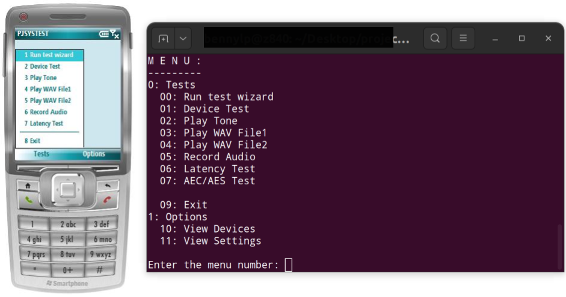

Testing and optimizing audio device with pjsystest
=======================================================

.. contents:: Table of Contents
   :depth: 3

The **pjsystest** (:sourcedir:`pjsip-apps/src/pjsystest`) is an application 
introduced in PJSIP version 1.4 by ticket :issue:`920`. It perform series of tests 
to detect problems and measure the performance of the system, especially the audio 
subsystem, such as:

- playback test, 
- recording test, 
- audio device bursts, latency, and drifts, 
- AEC performance, as well as 
- displaying basic audio system information.

**pjsystest** can be used to fine tune the application settings to get
the most optimal setup for the target device.

Objectives
----------

The objectives are: 

- to eliminate audio device impairments as explained in :any:`/specific-guides/audio/checks/dev_quality`
- to minimize audio latency

Using pjsystest
---------------

Configuring Test Parameters
~~~~~~~~~~~~~~~~~~~~~~~~~~~

Test parameters (such as device IDs, clock rate, number of channels, and
default file paths) are hardcoded in :source:`pjsip-apps/src/pjsystest/systest.h`. 
These parameters may need to be modified for if necessary.

Invoking On Windows
~~~~~~~~~~~~~~~~~~~

With Visual Studio: 

- compile PJSIP distribution as usual, make sure ``pjsystest`` project is getting built.
- run ``pjsystest`` application from Visual Studio

Invoking On Linux/MacOS X
~~~~~~~~~~~~~~~~~~~~~~~~~

Just build the distribution and run pjsystest from ``pjsip-apps/bin``
directory.

iOS/iPhone Support
~~~~~~~~~~~~~~~~~~~~~~~~~

``pjsystest`` for iPhone is available in :sourcedir:`pjsip-apps/src/ipjsystest` directory.

(Legacy) Invoking On Windows Mobile
~~~~~~~~~~~~~~~~~~~~~~~~~~~~~~~~~~~~~~~~~~

With Visual Studio: 

- build the distribution and pjsystest 
- run pjsystest from the IDE 
- the EXE and the required WAV files will be deployed to the device automatically

Invoking on Embedded Targets
~~~~~~~~~~~~~~~~~~~~~~~~~~~~

-  build the distribution
-  copy ``pjsystest`` executable from ``pjsip-apps/bin`` and deploy to
   target
-  also deploy these two files from :sourcedir:`tests/pjsua/wavs` directory to
   the same directory in the target device as the pjsystest executable:

   -  ``input.8.wav``
   -  ``tock8.wav``

-  run ``pjsystest`` on the target device

Running the application
~~~~~~~~~~~~~~~~~~~~~~~

Once the application is running, just choose **Test Wizard** to run all
the tests, and follow the wizard instruction.

The console application may be a bit awkward to use with all the dialog
box emulation, but it works.

Getting the result
~~~~~~~~~~~~~~~~~~

Results are recorded to ``PJSYSTEST_RESULT.TXT`` file once the program exits. On Windows
Mobile, the file location is in the root device, while on other targets
it is in the directory where the application is run from.

Additional info and instructions are given the application is run.

.. warning::

   **Limitations**: by design, ``pjsystest`` would not be able to test audio latency if audio
   switchboard is used instead of the default conference bridge

Tasks
-----

Several things that could be experimented with using pjsystest:

Testing different audiodev API backends
~~~~~~~~~~~~~~~~~~~~~~~~~~~~~~~~~~~~~~~

Some targets platforms offer more than one audiodev API backends. 
There is no need to recompile the whole library to
experiment with different audiodev API backends, just change REC_DEV_ID
and PLAY_DEV_ID in :source:`pjsip-apps/src/pjsystest/systest.h` (as long as
the backend is enabled during compilation).

Testing different audio buffer size
~~~~~~~~~~~~~~~~~~~~~~~~~~~~~~~~~~~

Change :cpp:any:`OVERRIDE_AUDDEV_REC_LAT` and :cpp:any:`OVERRIDE_AUDDEV_PLAY_LAT` in
:source:`systest.h <pjsip-apps/src/pjsystest/systest.h>` to experiment with different 
audio buffer size (values are
in milliseconds). The objective is to get the minimum latency without
getting audio impairments.

Testing different audio device clock rate
~~~~~~~~~~~~~~~~~~~~~~~~~~~~~~~~~~~~~~~~~

Choosing higher clock rate in audio device can minimize latency. Change
:cpp:any:`DEV_CLOCK_RATE` in :source:`systest.h <pjsip-apps/src/pjsystest/systest.h>` 
to experiment with different clock
rates.
