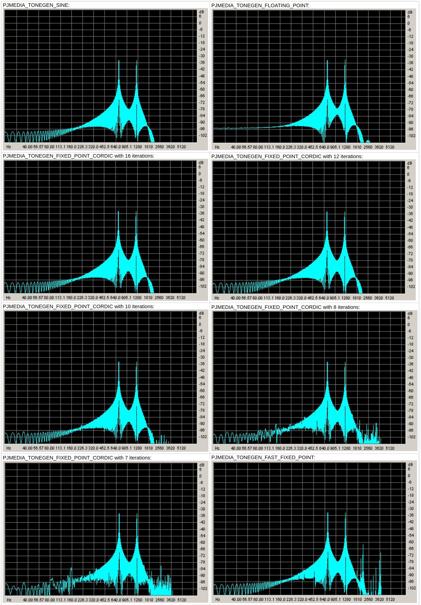

Tone generator algorithms performance
===========================================================

This article presents the performance analysis of various back-end
algorithms of the tone generator that are implemented in PJMEDIA.
Both the performance in both speed and accuracy terms will be analyzed.

.. contents:: Table of Contents
    :depth: 3

The Algorithms
--------------
The tone generator (tonegen.c) supports several algorithms, and since
version 1.0-rc3, the use of these algorithms can be controlled by
by using the :c:macro:`PJMEDIA_TONEGEN_ALG` macro setting:

- :c:macro:`PJMEDIA_TONEGEN_SINE`: the good-old generation using math's
  *sine()*, floating point. This has very good precision but it's the
  slowest and requires floating point support and linking with the math
  library.

- :c:macro:`PJMEDIA_TONEGEN_FLOATING_POINT`: (default when floating point is
  enabled):: Floating point approximation of *sine()*. This has relatively
  good precision and much faster than plain (sine()*, but it requires
  floating-point support and linking with the math library.

- :c:macro:`PJMEDIA_TONEGEN_FIXED_POINT_CORDIC`: (new in 1.0-rc3, and the
  default when floating point is disabled):: Fixed point using sine signal
  generated by a 28-bit `CORDIC <http://en.wikipedia.org/wiki/CORDIC>`__
  algorithm. This algorithm can be tuned to provide balance between
  precision and performance by tuning the
  :c:macro:`PJMEDIA_TONEGEN_FIXED_POINT_CORDIC_LOOP` setting, and it is suitable
  for platforms that lack floating-point support.

- :c:macro:`PJMEDIA_TONEGEN_FAST_FIXED_POINT`: Fast fixed point using some
  approximation to generate sine waves. The tone generated by this
  algorithm is not very precise, however the algorithm is very fast.

Accuracy
--------

For the accuracy test, we setup the tone generator to generate digit A
from `DTMF <http://en.wikipedia.org/wiki/DTMF>`__, with frequencies of
697 and 1209. We then saved the tone to a WAV file and analyzed the
frequency using CoolEdit (now becomes 
`Adobe Audition <http://www.adobe.com/special/products/audition/syntrillium.html>`__).

This is simple to do with *pjsua*:

.. code-block:: shell

        $ pjsua -play-tone 697,1209,200,2000 -rec-file tone.wav

then issue these commands: 

::

        cc 1 2
        sleep 5000
        cd 1 2
        q 

And here is the graphics from the frequency analysis.

Performance
-----------

Below is the time measurements of the algorithms. The test measures the
generation of 1 second worth of dual-tone at 8KHz sampling rate. For
single-tone, just divide the results by two, and for 16KHz dual-tone,
just multiply the results by two.

The MIPS value uses the same convention as in
:any:`/specific-guides/perf_footprint/pjmedia_mips`.

Linux, ARM9 (ARM926EJ-S), gcc
~~~~~~~~~~~~~~~~~~~~~~~~~~~~~

PJSIP was compiled with
``-O3 -msoft-float -DNDEBUG -DPJ_HAS_FLOATING_POINT=0`` flags.

+----------------------------------+-------------+---------+--------+
|                                  | time (usec) | CPU (%) | MIPS   |
+==================================+=============+=========+========+
| PJMEDIA_TONEGEN_SINE             | 506,535     | 50.653  | 100.29 |
+----------------------------------+-------------+---------+--------+
| PJMEDIA_TONEGEN_FLOATING_POINT   | 18,037      | 1.804   | 3.57   |
+----------------------------------+-------------+---------+--------+
| PJ                               | 17,694      | 1.769   | 3.50   |
| MEDIA_TONEGEN_FIXED_POINT_CORDIC |             |         |        |
| with 16 iterations               |             |         |        |
+----------------------------------+-------------+---------+--------+
| PJ                               | 13,561      | 1.356   | 2.69   |
| MEDIA_TONEGEN_FIXED_POINT_CORDIC |             |         |        |
| with 12 iterations               |             |         |        |
+----------------------------------+-------------+---------+--------+
| PJ                               | 11,662      | 1.166   | 2.31   |
| MEDIA_TONEGEN_FIXED_POINT_CORDIC |             |         |        |
| with 10 iterations               |             |         |        |
+----------------------------------+-------------+---------+--------+
| PJ                               | 9,872       | 0.987   | 1.95   |
| MEDIA_TONEGEN_FIXED_POINT_CORDIC |             |         |        |
| with 8 iterations                |             |         |        |
+----------------------------------+-------------+---------+--------+
| PJ                               | 8,943       | 0.894   | 1.77   |
| MEDIA_TONEGEN_FIXED_POINT_CORDIC |             |         |        |
| with 7 iterations                |             |         |        |
+----------------------------------+-------------+---------+--------+
| PJMEDIA_TONEGEN_FAST_FIXED_POINT | 1,449       | 0.145   | 0.29   |
+----------------------------------+-------------+---------+--------+

Windows, P4 2.66 GHz, Visual Studio 6
~~~~~~~~~~~~~~~~~~~~~~~~~~~~~~~~~~~~~

+-----------------------------------+-------------+---------+-------+
|                                   | time (usec) | CPU (%) | MIPS  |
+===================================+=============+=========+=======+
| PJMEDIA_TONEGEN_SINE              | 1,348       | 0.135   | 10.92 |
+-----------------------------------+-------------+---------+-------+
| PJMEDIA_TONEGEN_FLOATING_POINT    | 605         | 0.060   | 4.90  |
+-----------------------------------+-------------+---------+-------+
| P                                 | 1,372       | 0.137   | 11.12 |
| JMEDIA_TONEGEN_FIXED_POINT_CORDIC |             |         |       |
| with 16 iterations                |             |         |       |
+-----------------------------------+-------------+---------+-------+
| P                                 | 1,140       | 0.114   | 9.24  |
| JMEDIA_TONEGEN_FIXED_POINT_CORDIC |             |         |       |
| with 12 iterations                |             |         |       |
+-----------------------------------+-------------+---------+-------+
| P                                 | 998         | 0.100   | 8.09  |
| JMEDIA_TONEGEN_FIXED_POINT_CORDIC |             |         |       |
| with 10 iterations                |             |         |       |
+-----------------------------------+-------------+---------+-------+
| P                                 | 826         | 0.083   | 6.69  |
| JMEDIA_TONEGEN_FIXED_POINT_CORDIC |             |         |       |
| with 8 iterations                 |             |         |       |
+-----------------------------------+-------------+---------+-------+
| P                                 | 743         | 0.074   | 6.02  |
| JMEDIA_TONEGEN_FIXED_POINT_CORDIC |             |         |       |
| with 7 iterations                 |             |         |       |
+-----------------------------------+-------------+---------+-------+
| PJMEDIA_TONEGEN_FAST_FIXED_POINT  | 117         | 0.012   | 0.95  |
+-----------------------------------+-------------+---------+-------+

Conclusion
----------

Based on the results above, and as of version 1.0-rc3, we set the tone
generator settings in :any:`config_site.h` as follows: 

- on PC and platforms where floating point **is** available: 
  
  .. code-block:: c

        #define PJMEDIA_TONEGEN_ALG                     PJMEDIA_TONEGEN_FLOATING_POINT
        
- on platforms where floating point **is NOT** available:

  .. code-block:: c
        
        #define PJMEDIA_TONEGEN_ALG                     PJMEDIA_TONEGEN_FIXED_POINT_CORDIC
        #define PJMEDIA_TONEGEN_FIXED_POINT_CORDIC_LOOP 10

These settings of course can be overridden in your :any:`config_site.h` as
usual.
