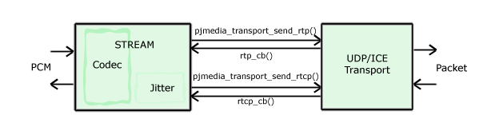
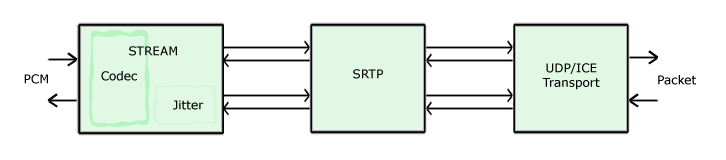

SRTP
=====================

This article describes about SRTP support in PJSIP. SRTP support is
included since version 0.9 (see ticket #61).

Features
--------

The SRTP functionality in PJSIP has the following features: 

- SRTP (`RFC 3711 <http://www.ietf.org/rfc/rfc3711.txt>`__), using the Open Source
  `libsrtp <http://sourceforge.net/projects/srtp/>`__ library. 
- Keys exchange using Security Descriptions for Media Streams (SDESC, `RFC
  4568 <http://www.ietf.org/rfc/rfc4568.txt>`__) 
- Supported cryptos:

  - AES_CM_128_HMAC_SHA1_80 
  - AES_CM_128_HMAC_SHA1_32 
- Secure RTCP (SRTCP) is supported.

Negotiation of crypto session parameters in SDP is currently not
supported.

Requirements
------------

SRTP feature in PJSIP uses the Open Source `libsrtp <http://sourceforge.net/projects/srtp/>`__ 
library created by David A. McGrew of Cisco Systems, Inc. Copy of
`libsrtp <http://sourceforge.net/projects/srtp/>`__ is included in PJSIP
source tree in ``third_party/srtp`` directory. There is no other
software to download.

`libsrtp <http://sourceforge.net/projects/srtp/>`__ is distributed under
BSD-like license, you must satisfy the license requirements if you
incorporate SRTP in your application. Please see :ref:`3rd Party Licensing <licensing_3rd_party>` 
page for more information.

How to integrate
-----------------

There is a new third party library in the distribution, namely
**libsrtp**, you will need to add this library into your
application's input libraries specification.

For GNU build systems
~~~~~~~~~~~~~~~~~~~~~~~~~~~~

#. You will need to re-run ``./configure``, ``make dep`` and ``make`` to update ``build.mak`` 
   and rebuild the project dependencies. 
#. If **your** Makefile includes ``build.mak`` , you just need to 
   rebuild your application as the input libraries will be updated automatically (by ``build.mak``). 
#. If you maintain your own independent Makefile, please add ``libsrtp-$(TARGET)``
   from ``third_party/lib`` directory to your input libraries.

For Visual Studio 6 and 2005
~~~~~~~~~~~~~~~~~~~~~~~~~~~~~~~~~~
#. New ``libsrtp`` project has been
   added into **pjproject.dsw** and **pjproject-vs8.sln** workspace. 
#. If you maintain your own application workspace, you need to add ``libsrtp``
   project into your application. The ``libsrtp`` project files are in
   ``third_party/build/srtp`` directory.

Building PJSIP with SRTP Support
--------------------------------

Availability
~~~~~~~~~~~~

SRTP feature is currently available in: 

- Visual C++ 6 and 2005 (for Windows targets) 
- GNU based build system (for Linux, including uC-Linux for embedded systems, Mingw, 
  MacOS X, and \*nix based platforms) 
- Windows Mobile targets (deprecated)
- Symbian targets (deprecated)

Building
~~~~~~~~

libsrtp is always built by default, from ``third_party/build/srtp``
directory.

Support for SRTP is enabled by default in PJMEDIA and PJSUA-LIB. To
**disable** this feature, declare :cpp:any:`PJMEDIA_HAS_SRTP` as zero in your ``config_site.h``:

::

   #define PJMEDIA_HAS_SRTP  0

Using SRTP
----------

SRTP is implemented as media transport in PJMEDIA. In the high level
:doc:`/api/pjsua-lib/index`, the
use of SRTP is controlled by couple of settings as explained below.

Using SRTP in PJSUA-LIB
~~~~~~~~~~~~~~~~~~~~~~~

In :doc:`/api/pjsua-lib/index`, the use of SRTP is controlled by settings in 
both :cpp:any:`pjsua_config` and :cpp:any:`pjsua_acc_config`. The settings in
:cpp:any:`pjsua_config` specify the default settings for all accounts, and the settings in
:cpp:any:`pjsua_acc_config` can be used to further set the behavior for that specific account.

In both :cpp:any:`pjsua_config` and :cpp:any:`pjsua_acc_config`, there are two
configuration items related to SRTP:

``use_srtp``

The :cpp:any:`pjsua_config::use_srtp` and :cpp:any:`pjsua_acc_config::use_srtp` options control whether secure media transport (SRTP) should be used for this account. Valid values are: 

- :cpp:any:`PJMEDIA_SRTP_DISABLED` (0): SRTP is disabled, and incoming call with
  RTP/SAVP transport will be rejected with 488/Not Acceptable Here
  response. 
- :cpp:any:`PJMEDIA_SRTP_OPTIONAL` (1): SRTP will be advertised and
  SRTP will be used if remote supports it, but the call may fall back to
  unsecure media. Incoming call with RTP/SAVP is accepted and responded
  with RTP/SAVP too. 
- :cpp:any:`PJMEDIA_SRTP_MANDATORY` (2): secure media is
  mandatory, and the call can only proceed if secure media can be
  established. 
     
The default value for this option is :cpp:any:`PJSUA_DEFAULT_USE_SRTP`, which is zero (disabled).

``srtp_secure_signaling``

The :cpp:any:`pjsua_config::srtp_secure_signaling` and :cpp:any:`pjsua_acc_config::srtp_secure_signaling` options controls whether SRTP requires secure signaling to be used. This option is only used when ``use_srtp`` option above is non-zero. Valid values are: 

- 0: SRTP does not require secure signaling (not recommended) 
- 1: SRTP requires secure transport such as TLS to be used. 
- 2: SRTP requires secure end-to-end transport (``sips:`` URI scheme) to be used. 

The default value for this option is :cpp:any:`PJSUA_DEFAULT_SRTP_SECURE_SIGNALING`, 
which is 1 (require TLS transport).

pjsua
~~~~~

Two new options were added to *pjsua*:

- ``--use-srtp=N`` This corresponds to ``use_srtp`` setting above.
  Valid values are 0, 1, or 2. Default value is 0.
- ``--srtp-secure=N`` This corresponds to ``srtp_secure_signaling``
  setting above. Valid values are 0, 1, or 2. Default value is 1.

Sample usage:

::

    $ ./pjsua --use-tls --use-srtp=1 sip:alice@example.com;transport=tls

Using SRTP Transport Directly
~~~~~~~~~~~~~~~~~~~~~~~~~~~~~

The SRTP transport may also be used directly without having to involve
SDP negotiations (for example, to use SRTP without SIP). Please see
``streamutil`` from the :doc:`/api/samples` collection for a sample application. 
For this to work, you will need to have a different mechanism to exchange keys between
endpoints.

To use SRTP transport directly: 

- Call :cpp:any:`pjmedia_transport_srtp_create()` to create the SRTP adapter, giving it the actual media transport
  instance (such as UDP transport). 
- Call :cpp:any:`pjmedia_transport_srtp_start()` to active SRTP session, giving it both local and remote crypto settings
  and keys. 
- Call :cpp:any:`pjmedia_transport_attach()` to configure the remote RTP/RTCP addresses and attach your RTP and RTCP
  callbacks. 
- Call :cpp:any:`pjmedia_transport_send_rtp()` and  :cpp:any:`pjmedia_transport_send_rtcp()` to send RTP/RTCP packets. 
- Once you done with your session, call :cpp:any:`pjmedia_transport_close()` 
  to destroy the SRTP adapter (and optionally the actual transport which
  is attached to the SRTP adapter, depending on whether *close_member_tp*
  flag is set in the :cpp:any:`pjmedia_srtp_setting`  when creating the SRTP adapter).

Implementation Notes
--------------------

Changes in Media Transport Interface
~~~~~~~~~~~~~~~~~~~~~~~~~~~~~~~~~~~~~~~~~~~~~~~~~~~~~~~~

Since the availability of SRTP changes SDP (Session Description
Protocol) contents and the SDP negotiation, we needed to modify/add new
interfaces in PJMEDIA transport API to allow media transport to modify
and negotiate SDP. Incidently this would work well with ICE too
(previously we treat ICE as a special kind of media transport so it is
treated differently, but with this new interfaces, all media transports
will behave uniformly (anyway that’s what API abstraction is for!)).

New interfaces in media transport are as follows:

- :cpp:any:`pjmedia_transport_op::media_create()`

  This callback is called by application (or PJSUA-LIB) to allow the media
  transport to add more information in the SDP offer, before the offer is
  sent to remote. Additionally, for answerer side, this callback allows
  the media transport to reject the offer before this offer is processed
  by the SDP negotiator.

- :cpp:any:`pjmedia_transport_op::media_start()`

  This callback is called after offer and answer are negotiated, and both
  SDPs are available, and before the media is started. For answerer side,
  this callback will be called before the answer is sent to remote, to
  allow media transport to put additional info in the SDP. For offerer
  side, this callback will be called after SDP answer is received. In this
  callback, the media transport has the final chance to negotiate/validate
  the offer and answer before media is really started (and answer is sent,
  for answerer side).

- :cpp:any:`pjmedia_transport_op::media_stop()`

  This callback is called when the media is stopped, to allow the media
  transport to release its resources.

- :cpp:any:`pjmedia_transport_op::simulate_lost()`

  This has nothing to do with SRTP, but since all media transports support
  this feature (packet loss simulation), we added this as a new interface.

pjmedia_transport_srtp Implementation
~~~~~~~~~~~~~~~~~~~~~~~~~~~~~~~~~~~~~

As we know, media transport is separated from the stream object (which
does the encoding/decoding of PCM frames, (de)packetization of RTP/RTCP
packets, and de-jitter buffering). The connection between stream and
media transport is established when the stream is created (we need to
specify media transport during stream creation), and the interconnection
can be depicted from the diagram below:

   media-transport.png

I think the diagram above is self-explanatory.

SRTP functionality is implemented as some kind of “adapter”, which is
plugged between the stream and the actual media transport that does
sending/receiving RTP/RTCP packets. When SRTP is used, the
interconnection between stream and transport is like the diagram below:

   media-srtp-transport.png

So to stream, the SRTP transport behaves as if it is a media transport
(because it **is** a media transport), and to the media transport it
behaves as if it is a stream. The SRTP object then forwards RTP packets
back and forth between stream and the actual transport,
encrypting/decrypting the RTP/RTCP packets as necessary.

The neat thing about this design is the SRTP “adapter” then can be used
to encrypt any kind of media transports. We currently have UDP and ICE
media transports that can benefit SRTP, and we could add SRTP to any
media transports that will be added in the future.

AES-GCM support
-----------------

Pjsip 2.6 enabled the support for AES-GCM (#1943), however the bundled
libSRTP (1.5.4) at that time has compatibility issue with OpenSSL 1.1.0.
Updating the libSRTP was done in #1993, included in 2.7.

As an alternative to the bundled libSRTP, users are also allowed to use
external libSRTP by specifying ``--with-external-srtp``. Using #2050,
it's been tested to work with external libSRTP 1.5.4 and 2.1.0. Note
about this option, using libSRTP with AES-GCM would also require the
user to enable building pjsip with ssl.
